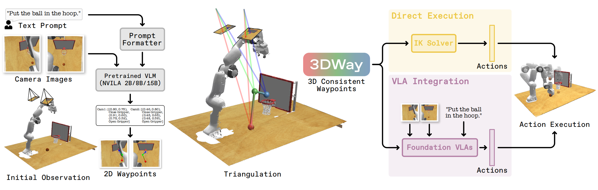

<div align="center">

# 3DWay: Generalizing Robot Manipulation via 3D Consistent Waypoints

**ECCV 2026**

<a href="https://arxiv.org/abs/2609.08224" target="_blank" rel="noopener noreferrer"></a>
<a href="https://arxiv.org/abs/2609.08224"></a>
<a href="https://ziqin-h.github.io/3DWay/"></a>
<a href="https://huggingface.co/liyy4586/3DWay-15B"></a>
<a href="https://huggingface.co/datasets/liyy4586/3DWay-Data"></a>

Ziqin Huang<sup>\*</sup>, Yingyue Li<sup>\*</sup>, Chenyangguang Zhang,
Ruida Zhang, Yuxin Chen, Gu Wang, Xingyu Liu, Masayoshi Tomizuka, Xiangyang Ji

<sup>\*</sup> Equal contribution

Tsinghua University · ETH Zürich · University of California, Berkeley · ITOOM

<a href="https://ziqin-h.github.io/3DWay/"><strong>Project Page</strong></a>
&nbsp;·&nbsp;
<a href="https://arxiv.org/abs/2609.08224"><strong>Paper</strong></a>
&nbsp;·&nbsp;
<a href="https://youtu.be/UXh61yWgI44"><strong>Video</strong></a>

</div>

<p align="center">
  
</p>

> **TL;DR:** 3DWay lets a vision-language model predict corresponding 2D
> waypoints from calibrated camera views, then uses geometry to reconstruct an
> explicit 3D trajectory. The resulting waypoints can be executed directly on
> simple tasks or used to guide a foundation vision-language-action model.

## Overview

Trajectory representations provide a compact bridge between visual-language
reasoning and robot control, but image-space trajectories are ambiguous in 3D.
Lifting a single-view trajectory with depth does not fully solve this problem:
depth is noisy, and free-space waypoints do not necessarily lie on observed
surfaces.

3DWay instead predicts **multi-view consistent 2D waypoints (2D-MCW)** in a
VLM-friendly text format. Given known camera intrinsics and extrinsics,
corresponding rays are triangulated into **3D Consistent Waypoints** in the
world frame. This keeps prediction in the modality where pretrained VLMs are
strong while producing an explicit and actionable 3D representation.

The released pipeline supports:

1. fine-tuning NVILA at 2B, 8B, or 15B scale for multi-view waypoint generation;
2. serving a fine-tuned checkpoint through an OpenAI-compatible endpoint;
3. parsing paired 2D trajectories and triangulating them into 3D;
4. exporting pose-plus-gripper actions and 2D/3D visualizations.

## Results

The paper evaluates 3DWay in simulation and on a real AgileX PIPER robot.
Selected headline results are shown below; see the
[paper](https://arxiv.org/abs/2609.08224) for protocols, uncertainty estimates, and full
ablations.

| Evaluation | Setting | Reported success rate |
| --- | --- | ---: |
| RLBench | 3DWay-TD, unseen tasks | **64.0%** |
| VLABench | 3DWay-TD, average over five generalization dimensions | **37.7%** |
| RLBench | Few-shot $\pi_0$: standard → 3DWay-augmented | **17.6% → 46.1%** |
| Real robot | Basic tasks: standard $\pi_0$ → 3DWay-augmented | **21.7% → 65.8%** |

The training set is constructed from
[RLBench](https://github.com/stepjam/RLBench),
[DROID](https://droid-dataset.github.io/), and
[RH20T](https://rh20t.github.io/), covering roughly 290 tasks and 134k
trajectories. [RoboPoint](https://robo-point.github.io/) is used first to
improve pixel-level point prediction.

## Repository layout

```text
3DWay/
├── 3dway_policy/        # Policy client, geometry, output, and visualization tools
├── docs/                # Static project website
├── scripts/             # Environment, training, patching, and serving entry points
├── VILA/                # Pinned upstream VILA git submodule
└── README.md
```

The repository keeps project-owned VILA changes in
[`scripts/patches/vila-1806a64.patch`](scripts/patches/vila-1806a64.patch).
The VILA submodule itself remains pinned to a reproducible upstream commit.

## Installation

### 1. Clone recursively

```bash
git clone --recurse-submodules https://github.com/ziqin-h/3DWay.git
cd 3DWay
```

For an existing checkout:

```bash
git submodule update --init --recursive
```

VILA is pinned to commit
`1806a646c24233726fe61bfff30bc5ef91444a77`.

### 2. Create the VILA environment

Apply the compatibility patch **before** VILA's editable installation creates
`VILA/vila.egg-info/`. The wrapper below enforces the correct order and then
runs the upstream environment setup:

```bash
bash scripts/setup_vila_env.sh vila
conda activate vila
```

### 3. Install the policy package

```bash
python -m pip install -e ./3dway_policy
```

For Open3D visualization:

```bash
python -m pip install -e './3dway_policy[visualization]'
```

## Training

The released launcher follows the paper's two-stage training structure:

1. fine-tune the NVILA backbone on RoboPoint;
2. fine-tune on the combined DROID, RLBench, and RH20T multi-view data.

Download the [official NVILA-Lite base checkpoint](https://huggingface.co/collections/Efficient-Large-Model/nvila). 
And download the [3DWay-Data](https://huggingface.co/datasets/liyy4586/3DWay-Data) and [RoboPoint](https://huggingface.co/datasets/wentao-yuan/robopoint-data) datasets from Hugging Face.

`DATA_ROOT` should use the following layout:

```text
$DATA_ROOT/
├── robopoint/
│   ├── robopoint_1432k.json
│   └── images/
└── 3DWay-Data/
    ├── droid.json
    ├── droid/
    ├── rh20t.json
    ├── rh20t/
    ├── rlbench.json
    └── rlbench/
```

Stage 1 — fine-tune `NVILA-Lite-15B` on RoboPoint:

```bash
bash scripts/train_stage.sh \
  NVILA-Lite-15B \
  robopoint_1432k \
  1 \
  1e-5
```

By default, the Stage 1 checkpoint is written to
`$FINETUNED_ROOT/NVILA-Lite-15B-robopoint_1432k-e1-LR1e-5`.

Stage 2 — continue from the Stage 1 checkpoint on DROID, RLBench, and RH20T:

```bash
bash scripts/train_stage.sh \
  NVILA-Lite-15B-robopoint_1432k-e1-LR1e-5 \
  'droid+rlbench+rh20t' \
  10 \
  1e-5
```

The Stage 2 dataset aliases above resolve to `droid.json`, `rlbench.json`, and
`rh20t.json` in `$DATA_ROOT/3DWay-Data`. If Stage 1 was written to a custom
location, pass that checkpoint path as the first argument to the Stage 2
command.

Important overrides:

| Variable | Default | Purpose |
| --- | --- | --- |
| `LEARNING_RATE` | `1e-5` | Learning rate for both stages |
| `MULTIVIEW_ROOT` | `$DATA_ROOT/3DWay-Data` | Multi-view JSON root |
| `MULTIVIEW_MEDIA_DIR` | `$MULTIVIEW_ROOT` | Common root for relative multi-view image paths |
| `GPUS_PER_NODE` | `8` | Training processes per node |
| `NNODES` | `1` | Number of training nodes |
| `PER_DEVICE_TRAIN_BATCH_SIZE` | `16` | Per-device batch size |
| `GRADIENT_ACCUMULATION_STEPS` | `2` | Gradient accumulation |
| `WANDB_MODE` | `offline` | Weights & Biases mode |

The general single-stage command is:

```bash
bash scripts/train_stage.sh \
  <model-name-or-path> \
  <dataset-mixture> \
  <epochs> \
  <learning-rate> \
  [output-dir]
```

## Deployment and policy inference

Start the OpenAI-compatible NVILA server:

```bash
CUDA_VISIBLE_DEVICES=0 \
  bash scripts/run_server_nvila.sh /path/to/3DWay-15B
```

In another shell, query it with the paired-view example. `--model` must match
the checkpoint directory name reported by the server:

```bash
conda activate vila

python 3dway_policy/examples/run_policy.py \
  --model 3DWay-15B \
  --instruction "put the ball in the hoop"
```

For a remote server:

```bash
python 3dway_policy/examples/run_policy.py \
  --model 3DWay-15B \
  --base-url http://<server-ip>:8888 \
  --instruction "put the ball in the hoop"
```

The example writes `prediction.json` and a trajectory overlay for each camera
view under `3dway_policy/outputs/`. See
[`3dway_policy/README.md`](3dway_policy/README.md) for the input/output
contract, camera convention, offline replay, and Open3D visualization.


## Citation

If you find 3DWay useful, please cite:

```bibtex
@inproceedings{3dway2026,
  title     = {3DWay: Generalizing Robot Manipulation via 3D Consistent Waypoints},
  author    = {Huang, Ziqin and Li, Yingyue and Zhang, Chenyangguang and Zhang, Ruida and Chen, Yuxin and Wang, Gu and Liu, Xingyu and Tomizuka, Masayoshi and Ji, Xiangyang},
  booktitle = {European Conference on Computer Vision (ECCV)},
  year      = {2026}
}
```

## Acknowledgements

This codebase builds on [VILA/NVILA](https://github.com/NVlabs/VILA). We also
thank the authors and maintainers of RoboPoint, RLBench, DROID, RH20T, and the
other research platforms used in the paper.
